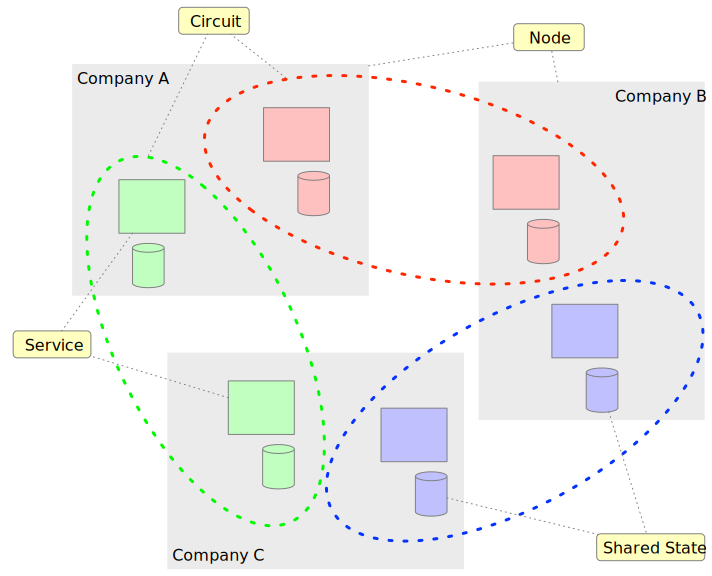
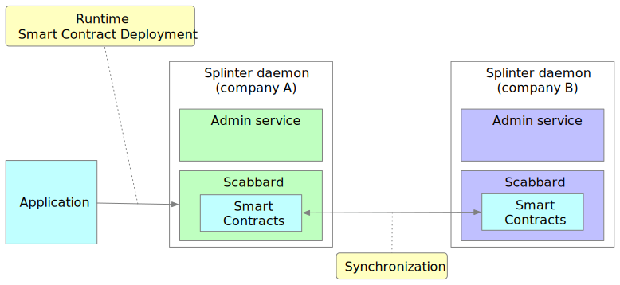
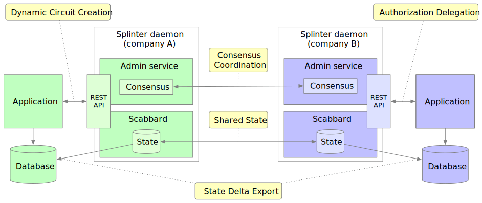

# Splinter

Splinter is a privacy-focused platform for distributed applications that provides
a blockchain-inspired networking environment for communication and transactions
between organizations. Splinter lets you combine blockchain-related technologies
-- such as smart contracts and consensus engines -- to build a wide variety
of architectural patterns.

 &hercon; [Features](#features-and-concepts) &hercon; [Building Splinter](#building-splinter) &hercon; [Demos](#demos) &hercon; [License](#license) &hercon;

## Features and Concepts

Splinter allows the same network to do two-party private communication,
multi-party private communication, and network-wide multi-party shared state,
all managed with consensus. A Splinter network enables multi-party or two-party
private conversations between nodes using circuits and services.

  - A _**node**_ is the foundational runtime that allows an organization to 
  participate in the network.

  - A _**circuit**_ is a virtual network within the broader Splinter network that 
  safely and securely enforces privacy scope boundaries.

  - A _**service**_ is an endpoint within a circuit that sends and receives
  private messages.

A Splinter application provides a set of distributed services that can
communicate with each other across a Splinter circuit.

**Splinter is designed for privacy**

The key concepts of Splinter are fundamentally anchored to privacy.

   - _**Circuits**_ define scope and visibility domains.
   - _**Shared state**_, a database updated by smart contracts, is visible only
     to the services within a circuit.

**Splinter is distributed and flexible**

Splinter works across a network 

   - _**State agreement**_ is achieved via the Merkle-radix tree in
     [Hyperledger Transact](https://github.com/hyperledger/transact/),
     allowing multiple services to prove they have the same data down to the 
	 last bit, cryptographically.
   - _**Consensus**_ is provided for creating real distributed applications.
     Splinter currently includes **two-phase commit** for 2- or 3-party
     conversations.
   - _**Connections**_ are dynamically constructed between nodes as circuits are
     created.

**Splinter is agile with smart contracts**

   - Smart contracts _**capture business logic**_ for processing transactions.
   - _**Runtime deployment**_ of smart contracts means no need to upgrade the
     Splinter software stack to add business logic.
   - _**Sandboxed WebAssembly smart contracts**_ keep the network safe and
     ensure determinism.
   - _**Scabbard**_, an out-of-the-box Splinter service that runs
     [Sawtooth Sabre](https://github.com/hyperledger/sawtooth-sabre)
     smart contracts across nodes, coordinated with consensus.

**Splinter is designed for applications**

   - _**State delta export**_ allows an application to materialize the
     Merkle-radix tree database to another database such as PostgreSQL.
     Applications can read from the materialized database (just like any other
     web application).
   - _**Admin services**_ provide applications with a REST API to dynamically
     create new circuits, based on business need.
   - _**Authorization**_ for circuit management can be delegated to application
     code and defined by business policies.

## Building Splinter

To build Splinter, run `cargo build` from the root directory. This command
builds all of the Splinter components, including `libsplinter` (the main
library), `splinterd` (the splinter daemon), the CLI, the client, and all
examples in the `examples` directory.

To build individual components, run `cargo build` in the component directories.
For example, to build only the Private XO demo, navigate to
`examples/private_xo`, then run `cargo build`.

## Demos

Splinter includes several example applications that you can run as demos. The
README in each directory explains how to run the demo.

- [Private Counter](examples/private_counter/): Three services communicate over
  a circuit to increment a shared counter.

- [Private XO](examples/private_xo/): Two services talk over a circuit to play
  a private game of tic tac toe (XO).

- [Gameroom](examples/gameroom/): Web application that allows you to set up a
  dynamic multi-party circuit (called a "gameroom") and play tic tac toe (XO).

## License

Splinter software is licensed under the [Apache License Version 2.0](LICENSE) software license.

## Code of Conduct

Splinter operates under the [Cargill Code of Conduct](https://github.com/Cargill/code-of-conduct/blob/master/code-of-conduct.md).